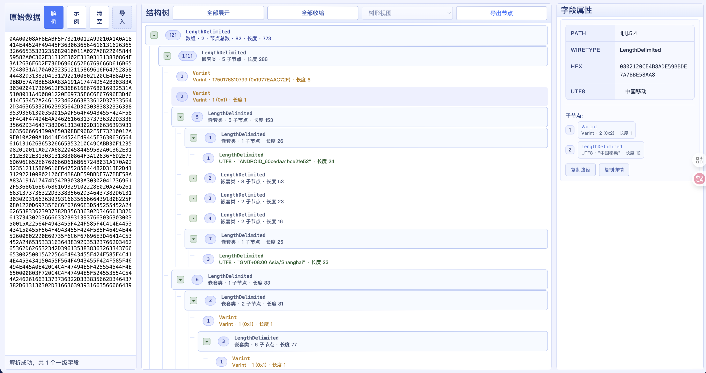

# Protobuf.DecodePro 🔍

<div align="center">


**一个强大的 Protobuf 数据解析和可视化工具**

[在线体验](#) | [快速开始](#快速开始) | [功能特性](#功能特性) | [文档](#使用说明)

</div>

---

## 📸 应用截图



> 将您的截图保存为 `docs/images/screenshot.png` 即可显示

---

## ✨ 功能特性

### 🎯 核心功能

- **多格式支持** - 支持十六进制、Base64、`\xAA` 格式的 Protobuf 数据输入
- **智能解析** - 自动识别 Protobuf 结构，支持嵌套类型和数组
- **树形可视化** - 直观的树形结构展示，支持展开/收缩
- **节点统计** - 实时显示节点总数和层级信息
- **一键导出** - 将解析结果导出到剪贴板，方便分享

### 🔧 高级特性

- **实时解析** - 输入即时解析，无需等待
- **详细属性** - 显示字段编号、Wire Type、原始值、十六进制等
- **文件导入** - 支持 `.bin`、`.pb`、`.txt` 等多种文件格式
- **美观 UI** - 现代化的界面设计，流畅的交互体验
- **跨平台** - 支持 Web、Desktop（Windows/macOS）多平台

### 📊 数据类型支持

- ✅ Varint（变长整数）
- ✅ Fixed32 / Fixed64（定长数值）
- ✅ LengthDelimited（字符串、嵌套类）
- ✅ UTF8 字符串自动识别
- ✅ 重复字段（数组）自动分组

---

## 🚀 快速开始

### 环境要求

- .NET 8.0 SDK 或更高版本
- 现代浏览器（Chrome、Edge、Firefox 等）

### 安装步骤

```bash
# 克隆仓库
git clone https://github.com/interface95/Protobuf.DecodePro.git
cd Protobuf.DecodePro

# 运行 Web 版本
cd Protobuf.Decode.Web
dotnet run

# 访问 http://localhost:5000
```

### 使用 Docker

```bash
# 构建镜像
docker-compose up -d

# 访问 http://localhost:8080
```

---

## 📖 使用说明

### 1️⃣ 输入数据

在左侧"原始数据"区域粘贴您的 Protobuf 数据，支持以下格式：

```
# 十六进制（空格分隔）
0A A0 02 08 AF 8E AB F5 F7 32 10 01

# 十六进制（连续）
0AA00208AF8EABF5F73210012A99010A

# \x 格式
\x0A\xA0\x02\x08\xAF\x8E\xAB\xF5

# Base64
CqACCK+Oq/X3MhABKpkBCg==
```

### 2️⃣ 解析数据

点击"解析"按钮，数据将自动解析并在中间的树形视图中展示。

### 3️⃣ 查看详情

- 点击树形视图中的任意节点查看详细属性
- 使用"全部展开"/"全部收缩"快速控制视图
- 第一个节点会显示节点总数统计

### 4️⃣ 导出结果

点击"导出节点"按钮，所有解析结果将复制到剪贴板，格式如下：

```
Protobuf 节点导出
================
导出时间: 2025-10-20 14:30:00
节点总数: 82
一级字段数: 2

节点详情:
--------
[2] 数组 · 2 · 节点总数 · 82 · 长度 · 773
  [1] LengthDelimited 嵌套类 · 5 子节点 · 长度 · 288
    ...
```

---

## 🏗️ 项目结构

```
Protobuf.DecodePro/
├── Protobuf.Decode.Parser/       # 核心解析引擎
│   ├── ProtoParser.cs             # Protobuf 解析器
│   ├── ProtoDisplayNode.cs        # 显示节点模型
│   └── ProtoWireType.cs           # Wire Type 枚举
├── Protobuf.Decode.Shared/        # 共享 Blazor 组件
│   ├── Components/                # UI 组件
│   │   ├── ProtoTreeView.razor    # 树形视图
│   │   ├── ProtoTreeViewNode.razor # 树节点
│   │   └── ProtoDetail.razor      # 详情面板
│   └── Pages/                     # 页面
│       └── ProtoInspector.razor   # 主页面
├── Protobuf.Decode.Web/           # Web 版本
├── Protobuf.Decode.Client/        # WASM 客户端
├── Protobuf.Decode.Desktop/       # Desktop 版本（MAUI）
└── Protobuf.Decode.Parser.Tests/  # 单元测试
```

---

## 🛠️ 技术栈

- **框架**: [.NET 8.0](https://dotnet.microsoft.com/)
- **前端**: [Blazor WebAssembly](https://dotnet.microsoft.com/apps/aspnet/web-apps/blazor)
- **桌面**: [.NET MAUI](https://dotnet.microsoft.com/apps/maui)
- **测试**: [xUnit](https://xunit.net/)
- **容器**: [Docker](https://www.docker.com/)

---

## 💻 开发工具

<div align="center">

### ⚡ 本项目完全使用 [**Cursor**](https://cursor.sh/) 开发

**Powered by Cursor - The AI-first Code Editor** 🚀

Cursor 是一款基于 AI 的智能代码编辑器，极大地提升了开发效率。


</div>

---

## 🤝 贡献指南

欢迎贡献代码！请遵循以下步骤：

1. Fork 本仓库
2. 创建您的特性分支 (`git checkout -b feature/AmazingFeature`)
3. 提交您的更改 (`git commit -m 'Add some AmazingFeature'`)
4. 推送到分支 (`git push origin feature/AmazingFeature`)
5. 开启一个 Pull Request

---

## 📝 更新日志

### v1.0.0 (2025-10-20)

- ✨ 初始版本发布
- 🎯 支持基础 Protobuf 解析
- 🌳 树形视图展示
- 📊 节点统计功能
- 📋 导出功能
- 🎨 优化 UI 设计

---

## 📄 许可证

本项目采用 MIT 许可证 - 查看 [LICENSE](LICENSE) 文件了解详情

---

## 🙏 致谢

- [Protocol Buffers](https://protobuf.dev/) - Google 的数据序列化格式
- [.NET](https://dotnet.microsoft.com/) - 微软的开源开发平台
- [Blazor](https://blazor.net/) - 使用 C# 构建交互式 Web UI
- [Cursor](https://cursor.sh/) - AI 驱动的代码编辑器

---

<div align="center">

**如果这个项目对您有帮助，请给个 ⭐ Star 支持一下！**

Made with ❤️ using [Cursor](https://cursor.sh/)

</div>
